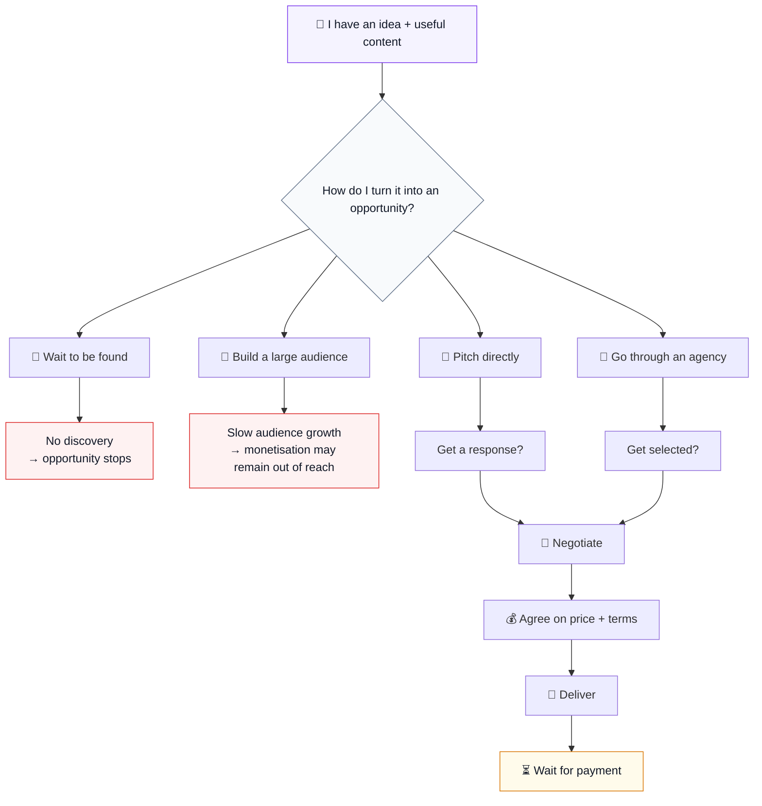
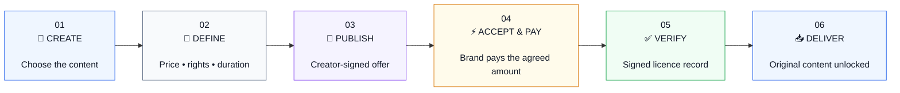
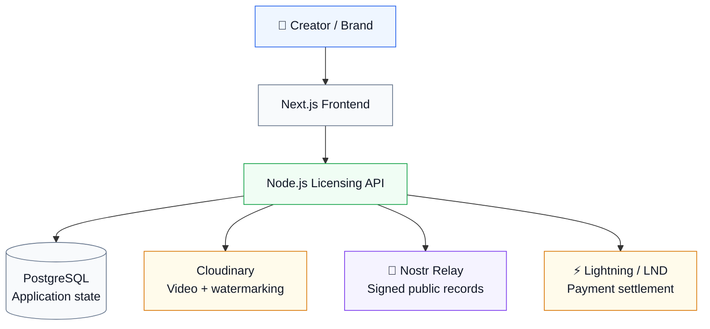

<div align="center">

# ⚡ ANZA ⚡

### **Make the first move.**

**Open infrastructure for digital rights and transactions.**

<br>


> **Creators should not have to wait to be chosen before their work can create value.**

</div>

---
---

# ✨ Overview

**Anza** is an open, decentralized licensing infrastructure that lets creators **make an offer, define the terms, and create a verifiable record of the transaction.**

For Hack4Freedom Nairobi 2026, we built a working creator-licensing application around that protocol.

The idea is simple:

**A creator has content → defines how it can be licensed → publishes the offer → a brand pays → the transaction becomes verifiable.**

| | What it does |
|---|---|
| 🔐 **Nostr** | Records *who offered what, under which terms* through signed events. |
| ⚡ **Lightning** | Handles *the payment* between buyer and creator. |

Anza connects those two pieces into one licensing flow.

------
# Premise
## 🌍 The opportunity is already here

The creator economy has already opened a new path to participation.

She can **create. Publish. Build an audience. Build trust.**


The market itself is already significant:

| 🌎 Global | 🇰🇪 Kenya |
|---|---|
| **$250B** creator advertising spend in 2025 | **KSh 1.07B** estimated creator payouts in 2025 |
| Estimated **$480B by 2027** | A growing, less mature commercial market |
###
###

Women make up **53.2% of Africa's creator population**, according to the 2024 Africa Creators' Survey. A 2026 Africa Creator Economy Report estimates the African creator economy at **$3.08B**, projected to reach **$17.84B by 2030**. Yet the same report highlights a paradox: African content can reach global audiences while creators still struggle to monetize locally.
###
###


 🔓 So is the opportunity truly accessible?
 ###
 ###
---

# 🧩 The Problem


### 🧪 What we heard from creators

We asked creators about their **[most recent brand deals](https://www.jotform.com/tables/262705169746062)**, focusing on what actually happened rather than what they thought they might do.
###

| | What we heard |
|---|---|
| **72%** | Had proactively created a brand opportunity without an existing campaign/brief |
| **68%** | Said deal terms were fragmented across different places |
| **64%** | Said payment happened after the work |
| **47%** | Had experienced terms becoming a disagreement |


----
###
###


 


###
###
###
A creator can have the talent, the idea and the product — but still need to:

- build a large audience before some platforms unlock monetisation;
- be discovered by a brand;
- be selected by an agency;
- understand pricing and usage rights jargon;
- deliver work before payment;
- know what to do when the agreement becomes a dispute.


---
###
###
THE DIFFICULT QUESTIONS THIS POSED ARE:

- **Does she have agency over her career?**

Not just access to a platform or audience but the ability to turn her skills, ideas and work into economic opportunity for herself.


- **Does she have a meaningful way to initiate the commercial relationship herself?**

When access to opportunity depends entirely on another person, that person can hold disproportionate power over the creator - sometimes creating room for exploitation, coercion or inappropriate demands.

- **Can she protect the value of her work?** 

When payment comes after delivery, the creator may have already surrendered the asset while carrying the risk of being paid late - or not at all. For a creator trying to build a sustainable career, income cannot depend on endlessly carrying that risk.
 😰 The fear exists on both sides

This is not simply a creator-vs-brand problem.
A brand may worry about:

- whether the content matches what was offered;
- whether the creator actually owns or controls the content;
- what rights the payment grants;
- whether the terms are clear;
- whether the transaction can be verified later.
###
###

> **Those findings shaped what we built.**
###
---

# 🚀 The Solution
###
###
###
## The missing piece

A transaction where both sides can verify before they commit — and where the creator does not have to surrender the original work before payment.


## ⚡ So we built ANZA - **An open licensing infrastructure that lets creators make the first move.**

> 🎬 One clear journey.


###

A creator can:

### **1 — CREATE**
🎥 A creator uploads content and chooses what they want to license.

### **2 — DEFINE**
📝 They set the **brand, price, usage rights and duration**.

### **3 — PUBLISH**
🔏 The creator signs the offer with their Nostr identity.

The offer becomes a public, verifiable record.

---
###
A brand can:
### **4 — 🔒 Browse Before payment**

The brand can **watch a watermarked preview**.

They can inspect the offer and its terms, but the original file remains protected.

### **5 — ⚡ Settle Payment**

The agreed Lightning payment is verified.

### **6 — 📥 Recieve Original File**

The licensed buyer can receive the **original downloadable file**, together with the signed licensing record.

> **Today: deliver first, then wait to be paid.**  
> **Anza flips the sequence: verify the offer → pay → deliver.**

---

# 🔏 Technology Stack.


## Nostr - **The Agreement Layer**


We asked a more fundamental question:

> **If two people are making a digital licensing agreement, what should actually become the shared record of what was agreed?**

Our answer was: **a signed Nostr event.**

When a creator makes an offer, **the creator signs it with their own Nostr identity.**

That offer contains the things that matter:

**What content. Who it's for. How much. What rights. For how long.**

So the record isn't simply:

> *“Anza's database says this creator offered this video for 25,000 sats.”*

It becomes:

> **“This creator's key signed this exact offer.”**


---

## 🧬 But what exactly was being licensed?

This created another problem.

A licensing agreement can say *“this video”* — but what does **this video** actually mean?

A URL can point to media.  
A title can change.  
A file can have different versions.

So we made the **content reference part of the thing being signed.**

### 🔐 The content gets a fingerprint.

That fingerprint is derived from the specific media reference/version being licensed and becomes part of the creator's signed Nostr offer.

So the offer doesn't just say:

> **“I am selling a video.”**

It carries a cryptographic reference to **which piece of content that offer is talking about.**

This helps keep the licensing record tied to the work it was created for — rather than leaving the agreement as a description that can become detached from the underlying content.

### The chain

```text
🎥 CONTENT
      ↓
🔐 CONTENT FINGERPRINT
      ↓
✍️ CREATOR-SIGNED NOSTR OFFER
      ↓
💰 PRICE • RIGHTS • DURATION • BRAND
      ↓
⚡ LIGHTNING PAYMENT
      ↓
📜 SIGNED LICENCE RECORD
```

## ⚡ Lightning - **What if geography wasn't the limit?**

Imagine a creator in **Nairobi** who genuinely loves a Korean skincare brand.

She creates content for it.

But instead of waiting for the brand to discover her, she can find the right contact, create an offer, define the terms and send it directly to the brand.

Now there is another question:

> **If the creator and the brand are on opposite sides of the world, how do they actually transact?**

This is where Lightning became an important part of our design.

### 🌍 We wanted the transaction to travel as easily as the opportunity.

Traditional payment systems can introduce another layer of geography, intermediaries, currencies and friction between two people who simply want to do business.

Lightning gives Anza a **digital-native settlement rail** that can operate across borders.

So the creator doesn't have to stop at:

> *“I found a global opportunity.”*

She can get closer to:

> **“I can actually transact on that opportunity.”**

And this is important to our vision of decentralization.

We are not only trying to decentralize **where the agreement lives**.

We are also exploring how to decentralize **how value moves between the people making that agreement.**

---

### The working MVP connects all pieces:



### In plain language

**PostgreSQL** remembers the application's state.

**Cloudinary** stores the video and creates the watermarked preview.

**Nostr** carries the signed offer and licence records.

**Lightning** handles payment settlement.

**Node.js** connects the rules.

**Next.js** gives creators and buyers the experience.

###

---

## 🧱 Why we built an engine, not just a marketplace

A marketplace would solve **one application problem**.

An open licensing engine can become a **building block**.
The underlying infrastructure can grow beyond a single application.

```text
                    ANZA PROTOCOL
                          │
          ┌───────────────┼───────────────┐
          ↓               ↓               ↓
     🛍️ Marketplaces   ⭐ Reputation   📊 Licensing data
          │               │               │
          └───────────────┼───────────────┘
                          ↓
                 New digital commerce
```

Possible future applications include:

- Creator marketplaces
- Portable reputation and work history
- Licensing analytics and market-rate discovery
- Cross-platform content licensing
- Micro-licensing
- New digital rights markets
- AI-related content licensing

The protocol becomes the common transaction layer underneath them.

> **Creators get more freedom to initiate.**
>
> **Developers get more freedom to build.**

---

## 🛠️ Whole Flow Built

### Creator experience

- 🎥 Video upload directly to Cloudinary
- 🔐 Nostr-based creator identity
- 🗂️ Private creator content library
- 📝 Offer creation from uploaded content
- 💰 Price, rights and duration
- 🔏 Browser-based Nostr signing
- 🔗 Shareable public offer links

### Brand experience

- 🌍 Published-offer discovery
- 👀 Watermarked content previews
- 📄 Visible licensing terms
- ⚡ Lightning invoice generation
- 🔎 Licence verification
- 📥 Protected delivery after successful payment in the final hackathon flow

### Licensing engine

- Signed Nostr offer events
- Signed settlement/licence events
- PostgreSQL persistence
- Durable Nostr event outbox and retry
- Idempotent operations
- Backend-verified Lightning settlement
- Content fingerprinting
- Clear payment/licence states
- Backend test coverage

---

###
###

# 🌱 What Anza Makes Possible?

Anza is designed around a licensing engine, not around a single marketplace.

That creates room for an ecosystem.

### 📈 Market rates become more visible

Over time, signed offers and completed transactions can reveal useful signals around **price, rights and duration**.

Not a fixed “correct” price — but evidence of what the market is actually asking and paying.

### 🌍 Global opportunity

Creators can proactively approach brands outside their immediate geography.

### 💰 Less exposure to payment delays

Payment-before-delivery reduces the creator's exposure to the risk of delivering first and waiting afterward.

### 🎥 Content becomes an asset

A piece of content can move from one-off campaign output toward a **reusable, licensable digital asset**, where the creator has defined what the buyer is purchasing.


---
###
###
# 🔭 Built for The Future of:

We see Anza as infrastructure for a broader shift:

### **01 — PERSONAL BRANDS**

Personal brands become businesses.

Creators turn skills, audiences and intellectual property into economic assets.

### **02 — MARKETING**

Every brand needs content in this digital age.

Marketing is moving toward continuous, platform-native content beyond traditional influencer campaigns.

### **03 — DECENTRALIZED TECHNOLOGY**

Web3 is here to stay. Identity, transactions and records do not have to live entirely inside one company's platform.

### **04 — OPEN INFRASTRUCTURE**

The future is open source. Anyone can build the next layer.

An open licensing engine could support:

`MARKETPLACES · REPUTATION · LICENSING ANALYTICS · AI LICENSING`

> **We don't want to build the one platform everyone has to use.**
>
> **We want to build the infrastructure others can build on.**
>
> And yes — if nobody builds on it, we may end up building those applications ourselves anyway. 😄
>
> **But the point is that they don't have to start from zero.**


## 🟢 Status

### **Hack4Freedom Nairobi 2026 — Working MVP**

The licensing engine is implemented end-to-end:

**Create → Sign → Publish → Pay → Settle → License**

The creator and discovery layers have also been built around it.

The final hackathon flow extends the verified licence into **protected original-file delivery**:

> **Watermarked preview → payment → verified licence → original download**

### Current development boundaries

This remains a hackathon MVP rather than a production deployment.

Remaining areas include:

- Buyer identity and acceptance
- Production Lightning infrastructure
- Staging environment
- Frontend test coverage and CI
- Production deployment, monitoring and operational controls

The current Lightning implementation uses **LND on local/regtest development infrastructure**. No real funds are represented by the hackathon payment flow.

---

# 🔭 Next Steps

### **01 — Finish the creator experience**

Complete the protected post-payment delivery flow and continue refining the creator-facing layer around the licensing engine.

### **02 — Make the transaction more familiar**

Explore payment abstraction so brands can pay through familiar local/fiat experiences while Lightning can operate underneath as a settlement rail.

### **03 — Add stronger identity and accountability**

Introduce buyer identity and acceptance, then build reputation signals around verified licensing activity.


---

## 👥 Team — Node One

| Name | Role |
|---|---|
| **Irene Mukii** | Product Owner & Fullstack Developer |
| **Nady** | Frontend Lead |
| **Aisha** | Backend Lead |
| **Jennifer** | Frontend |
| **Miriam** | Product Marketing & Communications |


---

## 🔗 Repository & Links

### 💻 Source Code

**[ANZA PROTOCOL — GitHub Repository](https://github.com/Aishagojo/ANZA)**

### 🎥 Demo

**[Watch the Demo](https://github.com/Aishagojo/ANZA) - TO BE UPDATED**

### 🌐 Project

**[Try Anza](https://github.com/Aishagojo/ANZA) - TO BE UPDATED**

---

<div align="center">

# ⚡ ANZA ⚡

### **Make the first move.**

**No creator should need permission to make the first move.**

<br>

**Creators get the freedom to initiate.**  
**Developers get the freedom to build.**

<br>

**Hack4Freedom Nairobi 2026 · Node One**

</div>
